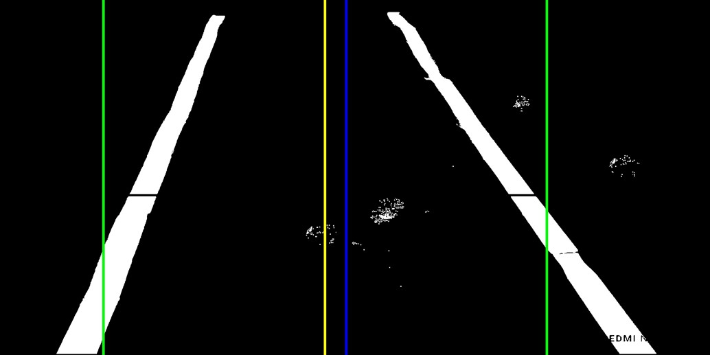

# Self-Driving Car Using Raspberry Pi

This is a short introduction to my project.

## Features

- A website where you can control the car
- Manual mode to control the car using a joystick
- AI mode to let the car drive itself
- Edge tracking algorithm
- TensorFlow Lite model

---

## Car Parts

- Arduino car 4WD
- Raspberry Pi 4
- Pi camera
- Google Coral (optional, but recommended)

---

## car test

- [youtube video](https://youtu.be/lxvGn5W3UPM)

---

## Car

<table>
 <tr>
  <td>   </td>
  <td>   </td>
 </tr>
</table>

---

## Note

- You need to change the lower and upper color values in the AIdrive/edgeDetectionModule.py file.
- You need to change the PATH_TO_CKPT and PATH_TO_LABELS values in the AIdrive/tfliteDetection.py file.

To install this project, you need to have Python 3 and some dependencies. You can use pip to install them:

pip install -r requirements.txt

Then, you can run the main script:

python app.py

---

## Objects We Have Trained On

---

## Model Results

---

## to train your model

- [use this colab notebook](https://colab.research.google.com/github/EdjeElectronics/TensorFlow-Lite-Object-Detection-on-Android-and-Raspberry-Pi/blob/master/Train_TFLite2_Object_Detction_Model.ipynb#scrollTo=eGEUZYAMEZ6f)

---

## Path Following Algorithm

### Example 1

### Example 2

### Example 3

More examples can be found in the data folder.

---

## Execution Mechanism

### Centralized Control Algorithm

### Command Issuing Algorithm

---

## License

This project is licensed under the MIT License. See the [LICENSE](LICENSE) file for more details.

## Links

- [LinkedIn](https://www.linkedin.com/in/3bdo-abdulbasit-abdulgani)
- [YouTube](https://www.youtube.com/@3bdo_sy)

MIT License

Free Software, Hell Yeah!
